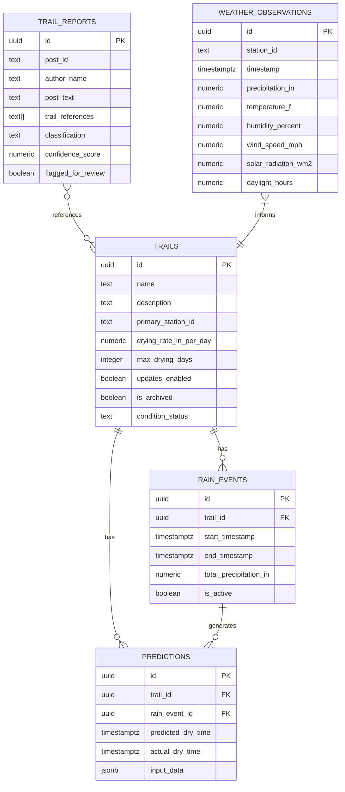

# Design Document: Trail Conditions Predictor

## Overview

The Trail Conditions Predictor is a Next.js 14 application deployed on Vercel that predicts mountain bike trail dryness after rain events. It replaces an existing Workato + Bubble + Google Sheets workflow with a unified, modern stack.

The system operates on a data pipeline model:
1. **Collect** — Vercel Cron jobs fetch weather observations (Weather Underground API) and trail condition posts (Facebook Graph API) on configurable intervals.
2. **Detect** — Rain events are detected from precipitation data and tracked with start/end timestamps and totals.
3. **Classify** — Incoming Facebook posts are classified by OpenAI to extract trail names and condition sentiment (dry, wet, inquiry, unrelated).
4. **Predict** — When a rain event ends, the Prediction Engine uses OpenAI with weather data + historical community reports to estimate dry time. Predictions update every 30 minutes while trails are "Drying".
5. **Display** — A dashboard shows current conditions, predicted dry times, recent reports, weather data, and historical trends.

### Key Technical Decisions

- **Next.js App Router** with API routes for cron endpoints and server components for the dashboard.
- **Vercel Postgres** (Neon) for PostgreSQL database.
- **Vercel Cron** for scheduled data collection (weather: adaptive — daily when dry, hourly when raining/drying; Facebook every 30 min; prediction refresh every 30 min).
- **OpenAI API** for post classification and drying predictions, with rule-based fallback.
- **Server-side rendering** for the dashboard to meet the 2-second load requirement.

## Architecture

```mermaid
graph TB
    subgraph "Vercel Cron Jobs"
        CW[Weather Cron<br/>adaptive: daily or hourly]
        CF[Facebook Cron<br/>every 30 min]
        CP[Prediction Cron<br/>every 30 min]
    end

    subgraph "Next.js API Routes"
        AW[/api/cron/weather]
        AF[/api/cron/facebook]
        AP[/api/cron/predict]
        AT[/api/trails]
        AH[/api/history]
    end

    subgraph "Services"
        WC[WeatherCollector]
        PC[PostCollector]
        RD[RainDetector]
        CL[PostClassifier]
        PE[PredictionEngine]
    end

    subgraph "External APIs"
        WU[api.weather.com]
        FB[Facebook Graph API]
        OA[OpenAI API]
    end

    subgraph "Vercel Postgres (Neon)"
        DB[(PostgreSQL)]
    end

    subgraph "Dashboard (App Router)"
        D1[Trail Status Page]
        D2[History Page]
        D3[Admin Page]
    end

    CW --> AW --> WC --> WU
    CF --> AF --> PC --> FB
    CP --> AP --> PE --> OA
    AF --> CL --> OA
    AW --> RD

    WC --> DB
    PC --> DB
    RD --> DB
    CL --> DB
    PE --> DB

    D1 --> DB
    D2 --> DB
    D3 --> AT
```

### Request Flow

1. **Weather Collection**: Cron → `/api/cron/weather` → `WeatherCollector.getActiveStationIds()` → for each unique station: `WeatherCollector.fetch()` → `api.weather.com` → deduplicate → store in `weather_observations` → `RainDetector.evaluate()` → create/extend/end rain events per trail.
2. **Facebook Collection**: Cron → `/api/cron/facebook` → `PostCollector.fetch()` → Facebook Graph API → deduplicate → store in `trail_reports` → `PostClassifier.classify()` → update classification fields.
3. **Prediction Refresh**: Cron → `/api/cron/predict` → `PredictionEngine.updatePredictions()` → for each "Probably Not Rideable" or "Probably Rideable" trail, query weather + history → OpenAI API → update predicted dry time. If predicted dry time has passed, transition to "Probably Rideable". If a classified report says "dry", mark trail as "Verified Rideable" and record actual outcome. If a report says "wet", mark as "Verified Not Rideable".
4. **Dashboard Load**: SSR page → query Vercel Postgres for trails, current conditions, recent reports, weather → render.

## Components and Interfaces

### WeatherCollector

Fetches and stores weather observations from Weather Underground.

```typescript
interface WeatherObservation {
  stationId: string;
  timestamp: Date;
  precipitationIn: number;
  temperatureF: number;
  humidityPercent: number;
  windSpeedMph: number;
  solarRadiationWm2: number;
  daylightHours: number;  // calculated from date + Austin latitude (~30.27°N)
}

interface WeatherCollector {
  /** Fetch latest observations from api.weather.com for a station. */
  fetchObservations(stationId: string, apiKey: string): Promise<WeatherObservation[]>;
  /** Store observations, skipping duplicates by timestamp+station. Returns count of new records. */
  storeObservations(observations: WeatherObservation[]): Promise<number>;
  /** Get distinct station IDs from all active trails with updates enabled. */
  getActiveStationIds(): Promise<string[]>;
}
```

### PostCollector

Fetches and stores Facebook group posts.

```typescript
interface TrailReport {
  postId: string;
  authorName: string;
  postText: string;
  timestamp: Date;
  trailReferences: string[];  // extracted trail names
  classification: 'dry' | 'wet' | 'inquiry' | 'unrelated' | null;
  confidenceScore: number | null;
  flaggedForReview: boolean;
}

interface PostCollector {
  /** Fetch recent posts from Facebook group. */
  fetchPosts(groupId: string, accessToken: string, since?: Date): Promise<TrailReport[]>;
  /** Store posts, skipping duplicates by postId. Returns count of new records. */
  storePosts(posts: TrailReport[]): Promise<number>;
}
```

### RainDetector

Detects and manages rain events from weather observations.

```typescript
interface RainEvent {
  id: string;
  trailId: string;
  startTimestamp: Date;
  endTimestamp: Date | null;
  totalPrecipitationIn: number;
  isActive: boolean;
}

interface RainDetector {
  /** Evaluate latest observations and create/extend/end rain events per trail based on their primary station. */
  evaluate(observations: WeatherObservation[]): Promise<RainEvent[]>;
  /** Check if 60 minutes have passed with no precipitation, ending active events. */
  checkForRainEnd(): Promise<RainEvent[]>;
}
```

### PostClassifier

Classifies trail reports using OpenAI.

```typescript
interface ClassificationResult {
  postId: string;
  classification: 'dry' | 'wet' | 'inquiry' | 'unrelated';
  trailReferences: string[];
  confidenceScore: number;
  flaggedForReview: boolean;
}

interface PostClassifier {
  /** Classify a trail report using OpenAI. */
  classify(report: TrailReport, knownTrails: string[]): Promise<ClassificationResult>;
  /** Fuzzy match trail names in text against known trail list. */
  extractTrailNames(text: string, knownTrails: string[]): string[];
}
```

### PredictionEngine

Generates and updates trail dryness predictions.

```typescript
interface Prediction {
  id: string;
  trailId: string;
  rainEventId: string;
  predictedDryTime: Date;
  actualDryTime: Date | null;
  createdAt: Date;
  updatedAt: Date;
  inputData: PredictionInput;
}

interface PredictionInput {
  totalPrecipitationIn: number;
  dryingRateInPerDay: number;
  maxDryingDays: number;
  temperatureF: number;
  humidityPercent: number;
  windSpeedMph: number;
  solarRadiationWm2: number;
  daylightHours: number;
  historicalOutcomes: HistoricalOutcome[];
}

interface HistoricalOutcome {
  precipitationIn: number;
  predictedDryTime: Date;
  actualDryTime: Date;
  weatherConditions: Partial<WeatherObservation>;
}

interface PredictionEngine {
  /** Generate prediction for a trail after a rain event ends. */
  predict(trail: Trail, rainEvent: RainEvent, currentWeather: WeatherObservation, history: HistoricalOutcome[]): Promise<Prediction>;
  /** Update predictions for all "Drying" trails with latest weather data. */
  updatePredictions(): Promise<Prediction[]>;
  /** Fall back to rule-based estimation when OpenAI is unavailable. */
  fallbackPredict(rainEvent: RainEvent, currentWeather: WeatherObservation): Date;
  /** Record actual dry time when a community report confirms trail is dry. */
  recordActualOutcome(trailId: string, rainEventId: string, actualDryTime: Date): Promise<void>;
}
```

### Trail Management

```typescript
interface Trail {
  id: string;
  name: string;
  description: string | null;
  primaryStationId: string;
  dryingRateInPerDay: number;  // inches of rain dried per day
  maxDryingDays: number;       // maximum days to fully dry
  updatesEnabled: boolean;     // whether weather updates are active
  isArchived: boolean;
  conditionStatus: 'Verified Rideable' | 'Probably Rideable' | 'Probably Not Rideable' | 'Verified Not Rideable';
  createdAt: Date;
  updatedAt: Date;
}

interface TrailService {
  create(data: { name: string; primaryStationId: string; dryingRateInPerDay: number; maxDryingDays: number; description?: string }): Promise<Trail>;
  update(id: string, data: Partial<Pick<Trail, 'name' | 'description' | 'primaryStationId' | 'dryingRateInPerDay' | 'maxDryingDays' | 'updatesEnabled'>>): Promise<Trail>;
  archive(id: string): Promise<Trail>;
  listActive(): Promise<Trail[]>;
  seed(trails: SeedTrail[]): Promise<void>;
}

interface SeedTrail {
  name: string;
  primaryStationId: string;
  dryingRateInPerDay: number;
  maxDryingDays: number;
  updatesEnabled: boolean;
}
```

### Configuration Validator

```typescript
interface AppConfig {
  weatherUnderground: { apiKey: string };
  facebook: { accessToken: string; groupId: string };
  openai: { apiKey: string };
  postgres: { url: string };
  cron: { weatherIntervalMin: number; facebookIntervalMin: number; predictionIntervalMin: number };
}

interface ConfigValidator {
  /** Validate all required env vars are present and correctly formatted. Throws with descriptive message on failure. */
  validate(): AppConfig;
}
```


### API Routes

| Route | Method | Purpose | Trigger |
|---|---|---|---|
| `/api/cron/weather` | GET | Check if polling is needed (adaptive), fetch + store weather observations, evaluate rain events | Vercel Cron (hourly) |
| `/api/cron/facebook` | GET | Fetch + store + classify Facebook posts | Vercel Cron (30 min) |
| `/api/cron/predict` | GET | Update predictions for all "Drying" trails | Vercel Cron (30 min) |
| `/api/trails` | GET/POST | List active trails / Create trail | Dashboard admin |
| `/api/trails/[id]` | PUT/DELETE | Update / Archive trail | Dashboard admin |
| `/api/history/[trailId]` | GET | Historical rain events + weather for a trail (internal/admin use) | Admin / AI context |

### Dashboard Pages

| Route | Purpose |
|---|---|
| `/` | Main dashboard — mobile-first trail list with status colors, estimated dry times, and last updated timestamp |
| `/admin` | Trail management — add, edit, archive trails |

## Data Models

### Database Schema (Vercel Postgres)

```sql
-- Trails
CREATE TABLE trails (
  id UUID PRIMARY KEY DEFAULT gen_random_uuid(),
  name TEXT NOT NULL UNIQUE,
  description TEXT,
  primary_station_id TEXT NOT NULL,
  drying_rate_in_per_day NUMERIC(4,2) NOT NULL DEFAULT 2.5,
  max_drying_days INTEGER NOT NULL DEFAULT 3,
  updates_enabled BOOLEAN NOT NULL DEFAULT true,
  is_archived BOOLEAN NOT NULL DEFAULT false,
  condition_status TEXT NOT NULL DEFAULT 'Probably Rideable' CHECK (condition_status IN ('Verified Rideable', 'Probably Rideable', 'Probably Not Rideable', 'Verified Not Rideable')),
  created_at TIMESTAMPTZ NOT NULL DEFAULT now(),
  updated_at TIMESTAMPTZ NOT NULL DEFAULT now()
);

-- Weather Observations (imperial units to match Weather Underground)
CREATE TABLE weather_observations (
  id UUID PRIMARY KEY DEFAULT gen_random_uuid(),
  station_id TEXT NOT NULL,
  timestamp TIMESTAMPTZ NOT NULL,
  precipitation_in NUMERIC(6,3) NOT NULL DEFAULT 0,
  temperature_f NUMERIC(5,1) NOT NULL,
  humidity_percent NUMERIC(5,1) NOT NULL,
  wind_speed_mph NUMERIC(6,1) NOT NULL,
  solar_radiation_wm2 NUMERIC(7,1) NOT NULL,
  daylight_hours NUMERIC(4,1) NOT NULL,
  created_at TIMESTAMPTZ NOT NULL DEFAULT now(),
  UNIQUE(station_id, timestamp)
);

-- Rain Events
CREATE TABLE rain_events (
  id UUID PRIMARY KEY DEFAULT gen_random_uuid(),
  trail_id UUID NOT NULL REFERENCES trails(id),
  start_timestamp TIMESTAMPTZ NOT NULL,
  end_timestamp TIMESTAMPTZ,
  total_precipitation_in NUMERIC(6,3) NOT NULL DEFAULT 0,
  is_active BOOLEAN NOT NULL DEFAULT true,
  created_at TIMESTAMPTZ NOT NULL DEFAULT now()
);

-- Trail Reports (Facebook posts)
CREATE TABLE trail_reports (
  id UUID PRIMARY KEY DEFAULT gen_random_uuid(),
  post_id TEXT NOT NULL UNIQUE,
  author_name TEXT NOT NULL,
  post_text TEXT NOT NULL,
  timestamp TIMESTAMPTZ NOT NULL,
  trail_references TEXT[] DEFAULT '{}',
  classification TEXT CHECK (classification IN ('dry', 'wet', 'inquiry', 'unrelated')),
  confidence_score NUMERIC(3,2),
  flagged_for_review BOOLEAN NOT NULL DEFAULT false,
  created_at TIMESTAMPTZ NOT NULL DEFAULT now()
);

-- Predictions
CREATE TABLE predictions (
  id UUID PRIMARY KEY DEFAULT gen_random_uuid(),
  trail_id UUID NOT NULL REFERENCES trails(id),
  rain_event_id UUID NOT NULL REFERENCES rain_events(id),
  predicted_dry_time TIMESTAMPTZ NOT NULL,
  actual_dry_time TIMESTAMPTZ,
  input_data JSONB NOT NULL,
  created_at TIMESTAMPTZ NOT NULL DEFAULT now(),
  updated_at TIMESTAMPTZ NOT NULL DEFAULT now()
);

-- Indexes for query performance
CREATE INDEX idx_weather_obs_timestamp ON weather_observations(timestamp DESC);
CREATE INDEX idx_weather_obs_station_ts ON weather_observations(station_id, timestamp DESC);
CREATE INDEX idx_rain_events_trail ON rain_events(trail_id, is_active);
CREATE INDEX idx_rain_events_active ON rain_events(is_active) WHERE is_active = true;
CREATE INDEX idx_trail_reports_timestamp ON trail_reports(timestamp DESC);
CREATE INDEX idx_trail_reports_classification ON trail_reports(classification) WHERE classification IS NOT NULL;
CREATE INDEX idx_predictions_trail ON predictions(trail_id, created_at DESC);
CREATE INDEX idx_trails_station ON trails(primary_station_id) WHERE is_archived = false;
```

### Seed Data

The system ships with 30 pre-configured Central Texas trails:

| Trail | Station ID | Drying Rate (in/day) | Max Days | Updates |
|---|---|---|---|---|
| Walnut Creek | KTXAUSTI2479 | 2.5 | 3 | Yes |
| Thumper | KTXAUSTI12445 | 3 | Yes | Yes |
| St. Edwards | KTXAUSTI1655 | 2.5 | 3 | Yes |
| Spider Mountain | KTXBURNE711 | 0 | 1 | No |
| SATN - east of mopac | KTXAUSTI8 | 2.5 | 3 | Yes |
| SATN - west of mopac | KTXAUSTI25 | 2.5 | 3 | Yes |
| Maxwell Trail | KTXAUSTI2587 | 2.5 | 3 | Yes |
| Rocky Hill Ranch | KTXSMITH825 | 1 | Yes | Yes |
| Reveille Peak Ranch | KTXBURNE1295 | 0 | No | No |
| Reimers Ranch | KTXSPICE395 | 3 | Yes | Yes |
| Pedernales Falls | KTXJOHNS3 | 2.5 | 3 | Yes |
| Pace Bend | KTXMARBL115 | 1 | Yes | Yes |
| Mule Shoe | KTXSPICE1235 | 1 | Yes | Yes |
| McKinney Falls | KTXAUSTI768 | 2.5 | 3 | Yes |
| Mary Moore Searight | KTXAUSTI18214 | 3 | Yes | Yes |
| Lakeway | KTXTHEHI45 | 2 | Yes | Yes |
| Lake Georgetown | KTXGEORG7815 | 3 | Yes | Yes |
| Flat Rock Ranch | KTXCOMFO545 | 1 | Yes | Yes |
| Flat Creek | — | — | — | No |
| Emma Long | KTXAUSTI30195 | 1 | Yes | Yes |
| Cat Mountain | KTXAUSTI36535 | 1 | Yes | Yes |
| Bull Creek | KTXAUSTI31165 | 2 | Yes | Yes |
| Brushy - West | KTXCEDAR192 | 2.5 | 2 | Yes |
| Brushy - Suburban Ninja | KTXCEDAR264 | 2.5 | 4 | Yes |
| Brushy - Double Down | KTXAUSTI36925 | 2 | Yes | Yes |
| Brushy - 1/4 Notch | KTXAUSTI36925 | 2 | Yes | Yes |
| Brushy - Peddlers | KTXAUSTI1134 | 2.5 | 3 | Yes |
| Bluff Creek Ranch | KTXLAGRA775 | 1 | Yes | Yes |
| BCGB - East | KTXAUSTI22775 | 2 | Yes | Yes |
| BCGB - West | KTXAUSTI32465 | 2 | Yes | Yes |

### Entity Relationships




## Correctness Properties

*A property is a characteristic or behavior that should hold true across all valid executions of a system — essentially, a formal statement about what the system should do. Properties serve as the bridge between human-readable specifications and machine-verifiable correctness guarantees.*

### Property 1: Weather observation storage round-trip

*For any* valid weather observation with a timestamp, precipitation, temperature, humidity, wind speed, and solar radiation, storing it via `storeObservations` and then querying by station ID and timestamp should return a record with all field values equal to the original.

**Validates: Requirements 1.2**

### Property 2: Weather observation idempotency

*For any* valid weather observation, calling `storeObservations` twice with the same observation (same station ID and timestamp) should result in exactly one record in the database and no error on the second call.

**Validates: Requirements 1.5**

### Property 3: Trail report storage round-trip

*For any* valid trail report with a post ID, author name, post text, and timestamp, storing it via `storePosts` and then querying by post ID should return a record with all field values equal to the original.

**Validates: Requirements 2.2**

### Property 4: Trail report idempotency

*For any* valid trail report, calling `storePosts` twice with the same report (same post ID) should result in exactly one record in the database and no error on the second call.

**Validates: Requirements 2.4**

### Property 5: Precipitation creates rain event with Wet status

*For any* weather observation with precipitation > 0 inches associated with a trail (via the trail's primary station), after `RainDetector.evaluate()` processes it, there should be an active rain event for that trail, and the trail's condition status should be "Verified Not Rideable".

**Validates: Requirements 3.1, 3.4**

### Property 6: Dry gap ends rain event

*For any* sequence of weather observations where the last 60+ minutes have zero precipitation, after `RainDetector.checkForRainEnd()`, any previously active rain event should be marked as ended (is_active = false) with a non-null end_timestamp and a total_precipitation_in equal to the sum of all precipitation observations during the event.

**Validates: Requirements 3.2, 3.3**

### Property 7: Rain event end triggers prediction with complete inputs

*For any* ended rain event and associated trail, `PredictionEngine.predict()` should produce a prediction whose `input_data` contains: total precipitation, the trail's drying rate, the trail's max drying days, temperature, humidity, wind speed, solar radiation, and an array of historical outcomes.

**Validates: Requirements 4.1, 4.2, 10.2**

### Property 8: Drying trails get updated predictions

*For any* trail with condition status "Probably Not Rideable" or "Probably Rideable", calling `PredictionEngine.updatePredictions()` should produce an updated prediction with a `updatedAt` timestamp later than or equal to the previous one.

**Validates: Requirements 4.3**

### Property 9: Dry report transitions trail to Verified Rideable and records outcome

*For any* trail in "Probably Not Rideable" or "Probably Rideable" status and any trail report classified as "dry" referencing that trail, processing the report should set the trail's condition status to "Verified Rideable" and record the actual dry time on the corresponding prediction.

**Validates: Requirements 4.5, 10.1**

### Property 10: Fallback prediction produces valid result

*For any* rain event with total precipitation > 0 and any current weather observation, `PredictionEngine.fallbackPredict()` should return a Date that is after the rain event's end timestamp.

**Validates: Requirements 4.6**

### Property 11: Dashboard data includes status and predicted dry time for drying trails

*For any* set of active trails, the dashboard data should include every non-archived trail with its condition status and a last-updated timestamp. For any trail with status "Probably Not Rideable" or "Probably Rideable", the data should also include a predicted dry time.

**Validates: Requirements 5.1, 5.2, 5.3, 5.6**

### Property 12: Trail management round-trip

*For any* valid trail name, station ID, drying rate, and max days, creating a trail and then reading it back should return the same values. Updating any field and reading back should reflect the new values.

**Validates: Requirements 6.1, 6.2**

### Property 13: Archiving excludes from active list but retains history

*For any* trail with associated rain events, predictions, and trail reports, archiving the trail should remove it from `listActive()` results, but all associated rain events, predictions, and trail reports should remain queryable.

**Validates: Requirements 6.3, 6.4**

### Property 14: Classification output validity

*For any* trail report text, `PostClassifier.classify()` should return a classification that is one of {"dry", "wet", "inquiry", "unrelated"}, a confidence score in the range [0, 1], and if the confidence score is below 0.6, the `flaggedForReview` field should be true.

**Validates: Requirements 7.1, 7.3, 7.4**

### Property 15: Fuzzy trail name extraction

*For any* known trail name and any text containing that trail name (possibly with minor typos or case variations), `PostClassifier.extractTrailNames()` should include that trail name in the returned array.

**Validates: Requirements 7.2**

### Property 16: Configuration validation rejects incomplete config

*For any* subset of required environment variables where at least one is missing, `ConfigValidator.validate()` should throw an error whose message contains the name of the missing variable.

**Validates: Requirements 8.2, 8.3**

### Property 17: Historical correlation query returns similar events

*For any* trail and rain event, querying historical data for similar conditions (precipitation within ±0.5 inches, temperature within ±10°F) should return only rain events for the same trail that match those criteria, ordered by most recent first.

**Validates: Requirements 9.2, 9.3**

### Property 18: Prediction accuracy calculation

*For any* list of predictions with actual outcomes, the accuracy percentage should equal the count of predictions where |predicted_dry_time - actual_dry_time| ≤ 2 hours, divided by the total count, times 100. The calculation should use at most the last 10 rain events.

**Validates: Requirements 10.3**

## Error Handling

### External API Failures

| API | Failure Mode | Handling |
|---|---|---|
| Weather Underground (api.weather.com) | HTTP error / timeout | Log error with details, skip this interval, retry on next cron run (Req 1.3) |
| Facebook Graph API | HTTP error / expired token | Log error with details, notify admin via stored alert record (Req 2.3) |
| OpenAI API | HTTP error / timeout / rate limit | Fall back to rule-based prediction using precipitation + elapsed time (Req 4.6) |
| Vercel Postgres | Connection error | Log error, return 500 from API route. Cron jobs retry on next interval |

### Data Validation Errors

- **Duplicate weather observations**: Silently skip via UNIQUE constraint + ON CONFLICT DO NOTHING (Req 1.5)
- **Duplicate trail reports**: Silently skip via UNIQUE constraint on post_id + ON CONFLICT DO NOTHING (Req 2.4)
- **Invalid weather data**: Reject observations with null/NaN values for required numeric fields before storage
- **Low-confidence classifications**: Flag for manual review when confidence < 0.6 (Req 7.4)

### Configuration Errors

- Missing environment variables: Application fails to start with descriptive error naming the missing variable (Req 8.2)
- Invalid API key format: Validation rejects before any API calls are attempted (Req 8.3)

### Fallback Strategy

The rule-based fallback prediction (Req 4.6) uses the trail's configured drying rate and max days:
```
daysToAbsorb = totalPrecipitationIn / trail.dryingRateInPerDay
estimatedDryHours = min(daysToAbsorb, trail.maxDryingDays) * 24
// Adjust for current conditions
estimatedDryHours *= (humidityPercent / 50)  // humidity slows drying
estimatedDryHours *= (1 - windSpeedMph * 0.005)  // wind helps
estimatedDryHours *= (1 - solarRadiationWm2 * 0.0003)  // sun helps
estimatedDryHours = max(estimatedDryHours, 1)  // minimum 1 hour
```
This uses each trail's actual drying characteristics rather than a one-size-fits-all formula.

## Testing Strategy

### Testing Framework

- **Unit & Integration Tests**: Vitest (fast, native TypeScript support, compatible with Next.js)
- **Property-Based Testing**: fast-check (mature PBT library for TypeScript/JavaScript)
- **Database Tests**: Test database via `@vercel/postgres` with test schema, or mocked database client

### Property-Based Tests

Each correctness property from the design document maps to a single property-based test using fast-check. Each test runs a minimum of 100 iterations.

Tests are tagged with comments referencing the design property:
```typescript
// Feature: trail-conditions-predictor, Property 1: Weather observation storage round-trip
```

Property tests focus on:
- Storage round-trips (Properties 1, 3, 12)
- Idempotency (Properties 2, 4)
- State machine transitions (Properties 5, 6, 8, 9)
- Output validity / invariants (Properties 7, 10, 11, 14, 15, 16, 17, 18)

Generators will produce:
- Random `WeatherObservation` objects with realistic ranges (temp: -20 to 50°C, humidity: 0-100%, etc.)
- Random `TrailReport` objects with varied post text
- Random `RainEvent` sequences with varying precipitation patterns
- Random trail names with fuzzy variations for extraction testing
- Random subsets of environment variables for config validation testing

### Unit Tests

Unit tests complement property tests for specific examples and edge cases:
- Weather API response parsing with sample JSON payloads
- Facebook API response parsing with sample post structures
- Rain event edge cases: exactly 60 minutes of no rain, precipitation at boundary of 0
- Classification edge cases: empty post text, posts in different languages
- Fallback prediction with extreme weather values
- Dashboard data assembly with zero trails, one trail, many trails
- Config validation with each individual missing variable
- Accuracy calculation with zero predictions, all accurate, none accurate

### Test Organization

```
src/
  __tests__/
    services/
      weather-collector.test.ts
      post-collector.test.ts
      rain-detector.test.ts
      post-classifier.test.ts
      prediction-engine.test.ts
      trail-service.test.ts
      config-validator.test.ts
    properties/
      weather-storage.property.test.ts
      post-storage.property.test.ts
      rain-detection.property.test.ts
      prediction.property.test.ts
      classification.property.test.ts
      dashboard.property.test.ts
      trail-management.property.test.ts
      config.property.test.ts
      history.property.test.ts
      accuracy.property.test.ts
```
