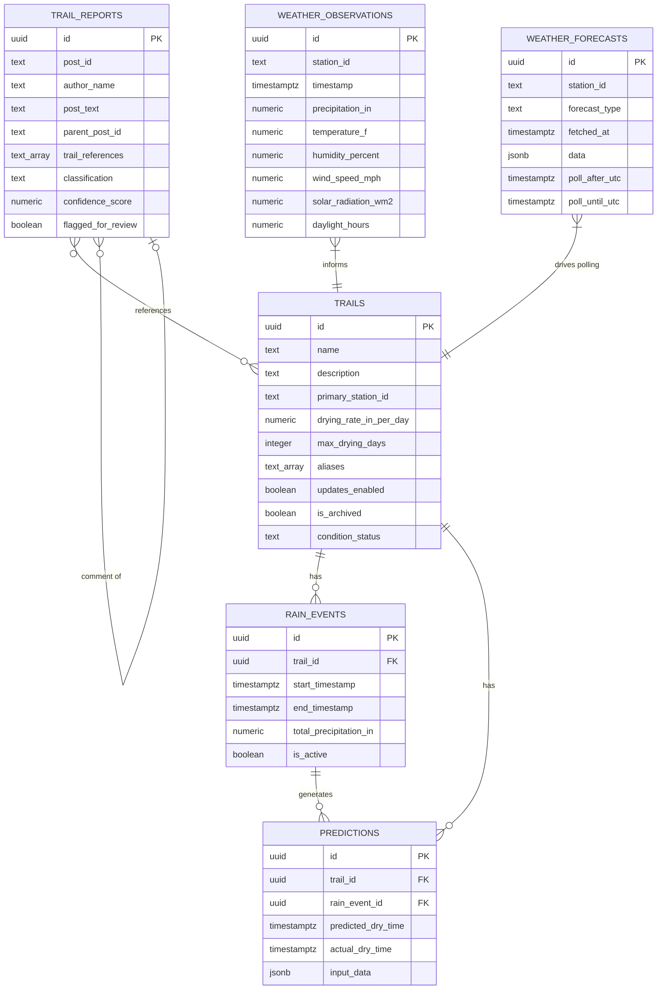

# Design Document: Trail Conditions Predictor

## Overview

The Trail Conditions Predictor is a Next.js 14 application deployed on Vercel that predicts mountain bike trail dryness after rain events. It replaces an existing Workato + Bubble + Google Sheets workflow with a unified, modern stack.

The system operates on a data pipeline model:
1. **Collect** — Vercel Cron jobs trigger weather observation fetching (Weather Underground API) and an external Puppeteer scraper posts trail condition reports to the /api/scrape/ingest endpoint.
2. **Detect** — Rain events are detected from precipitation data and tracked with start/end timestamps and totals.
3. **Classify** — Incoming Facebook posts are classified by OpenAI (with MTB slang awareness and trail alias support) to extract trail names and condition sentiment (dry, wet, inquiry, unrelated). Comments inherit trail references from parent posts when no direct matches are found.
4. **Verify** — The Trail Verifier validates wet reports against recent rain history (stale wet post protection) and expires stale "Verified Not Rideable" statuses when no rain exists within a trail's max_drying_days window.
5. **Predict** — When a rain event ends, the Prediction Engine uses OpenAI with weather data + historical community reports to estimate dry time. Predictions update every 30 minutes while trails are drying.
6. **Notify** — The Notification Service sends email alerts for station outages, cron failures, rain detection, forecast summaries, and cookie expiry.
7. **Display** — A dashboard shows current conditions with "Observed Dry/Wet" and "Predicted Dry/Wet" labels, predicted dry times, recent reports, and weather data.

### Key Technical Decisions

- **Next.js App Router** with API routes for cron endpoints and server components for the dashboard.
- **Vercel Postgres** (Neon) for PostgreSQL database.
- **Vercel Cron** for scheduled data collection. Weather uses a forecast-driven adaptive strategy: active rain or wet trails → hourly station polls; otherwise → 1 daily forecast API call (cached in `weather_forecasts` table); rain in forecast → 1 additional hourly forecast call to find rain window, then station polls from 4h before first rain through 3h after last rain; no rain in 5-day forecast → done (1 API call total).
- **External Puppeteer scraper** on a Linux server posts to /api/scrape/ingest (not Facebook Graph API).
- **OpenAI API** for post classification (with MTB slang and trail aliases) and drying predictions, with rule-based fallback.
- **Per-trail max_drying_days** stored in DB, auto-adjusted upward when wet reports arrive after the window.
- **Server-side rendering** for the dashboard to meet the 2-second load requirement.

## Architecture

```mermaid
graph TB
    subgraph "Vercel Cron Jobs"
        CW[Weather Cron<br/>adaptive: daily or hourly]
        CF[Facebook Cron<br/>every 30 min]
        CP[Prediction Cron<br/>every 30 min]
    end

    subgraph "External"
        SC[Puppeteer Scraper<br/>Linux server]
    end

    subgraph "Next.js API Routes"
        AW[/api/cron/weather]
        AF[/api/cron/facebook]
        AP[/api/cron/predict]
        AT[/api/trails]
        AH[/api/history]
        AI[/api/scrape/ingest]
        AS[/api/scrape/seen]
    end

    subgraph "Services"
        WC[WeatherCollector]
        PC[PostCollector]
        RD[RainDetector]
        CL[PostClassifier]
        PE[PredictionEngine]
        TV[TrailVerifier]
        NS[NotificationService]
        SH[StationHealth<br/>dead code / future]
    end

    subgraph "External APIs"
        WU[api.weather.com]
        OA[OpenAI API]
        EM[Email Service]
    end

    subgraph "Vercel Postgres (Neon)"
        DB[(PostgreSQL)]
    end

    subgraph "Dashboard (App Router)"
        D1[Trail Status Page]
        D2[History Page]
        D3[Admin Page]
        D4[Cookie Admin Page]
    end

    CW --> AW --> WC --> WU
    CF --> AF --> PC
    SC --> AI --> PC
    CP --> AP --> PE --> OA
    AI --> CL --> OA
    AW --> RD
    AP --> TV
    AF --> TV
    AI --> TV

    WC --> DB
    PC --> DB
    RD --> DB
    CL --> DB
    PE --> DB
    TV --> DB
    NS --> EM

    D1 --> DB
    D2 --> DB
    D3 --> AT
```

### Request Flow

1. **Weather Collection**: Cron → `/api/cron/weather` → Adaptive polling check: (a) if active rain or wet trails → poll stations hourly; (b) otherwise check 5-day daily forecast (cached in `weather_forecasts`); (c) if no rain ≥30% → skip stations (1 API call); (d) if rain found → call 2-day hourly forecast (2nd API call) → compute `poll_after_utc` (first rain hour - 4h) and `poll_until_utc` (last rain hour + 3h); (e) if now < poll_after_utc → skip; (f) if now > poll_until_utc and no actual precip → stop (false alarm); (g) if actual rain fell → hourly polling continues. For each station polled: `WeatherCollector.fetch()` → `api.weather.com` → deduplicate → store in `weather_observations` → `RainDetector.evaluate()` → create/extend/end rain events per trail. `NotificationService` sends rain detection and forecast summary emails.
2. **Scrape Ingest**: External Puppeteer scraper → POST `/api/scrape/ingest` → deduplicate → store in `trail_reports` → `PostClassifier.classify()` (with MTB slang prompt, trail aliases from DB, parent post trail reference inheritance for comments) → `TrailVerifier.expireStaleVerifications()` → update classification fields → return all classified posts with timestamps, trail assignments, and status changes in API response for scraper email summary.
3. **Facebook Cron**: Cron → `/api/cron/facebook` → triggers scraper coordination → `TrailVerifier.expireStaleVerifications()`.
4. **Prediction Refresh**: Cron → `/api/cron/predict` → `TrailVerifier.expireStaleVerifications()` → `PredictionEngine.updatePredictions()` → for each "Probably Not Rideable" or "Probably Rideable" trail, query weather + history → OpenAI API → update predicted dry time. If predicted dry time has passed, transition to "Probably Rideable". If a classified report says "dry", mark trail as "Verified Rideable" and record actual outcome. If a report says "wet", `TrailVerifier` checks rain history: skip if stale, bump max_drying_days if needed, or mark as "Verified Not Rideable".
5. **Dashboard Load**: SSR page → query Vercel Postgres for trails, current conditions, recent reports, weather → render with "Observed Dry/Wet" and "Predicted Dry/Wet" display labels.

## Components and Interfaces

### WeatherCollector

Fetches and stores weather observations and forecasts from Weather Underground.

```typescript
interface WeatherObservation {
  stationId: string;
  timestamp: Date;
  precipitationIn: number;
  temperatureF: number;
  humidityPercent: number;
  windSpeedMph: number;
  solarRadiationWm2: number;
  daylightHours: number;  // calculated from date + Austin latitude (~30.27°N)
}

interface WeatherForecast {
  stationId: string;
  forecastType: 'daily_5day' | 'hourly_2day';
  fetchedAt: Date;
  data: object;  // raw forecast JSON cached in weather_forecasts table
}

interface WeatherCollector {
  /** Fetch latest observations from api.weather.com for a station. */
  fetchObservations(stationId: string, apiKey: string): Promise<WeatherObservation[]>;
  /** Store observations, skipping duplicates by timestamp+station. Returns count of new records. */
  storeObservations(observations: WeatherObservation[]): Promise<number>;
  /** Get distinct station IDs from all active trails with updates enabled. */
  getActiveStationIds(): Promise<string[]>;
  /** Fetch and cache 5-day daily forecast. Returns cached version if fresh. */
  getDailyForecast(stationId: string, apiKey: string): Promise<WeatherForecast>;
  /** Fetch 2-day hourly forecast to find rain window. */
  getHourlyForecast(stationId: string, apiKey: string): Promise<WeatherForecast>;
  /** Determine polling strategy: returns poll_after_utc, poll_until_utc, or skip indicators. */
  determinePollingWindow(forecast: WeatherForecast): { pollAfterUtc: Date; pollUntilUtc: Date } | 'skip' | 'poll_now';
}
```

### PostCollector

Receives and stores trail reports from the external Puppeteer scraper.

```typescript
interface TrailReport {
  postId: string;
  authorName: string;
  postText: string;
  timestamp: Date;
  parentPostId: string | null;  // for comments, references the parent post
  trailReferences: string[];  // extracted trail names (may be inherited from parent)
  classification: 'dry' | 'wet' | 'inquiry' | 'unrelated' | null;
  confidenceScore: number | null;
  flaggedForReview: boolean;
}

interface PostCollector {
  /** Process posts received from external scraper via /api/scrape/ingest. */
  processPosts(posts: ScrapedPost[]): Promise<TrailReport[]>;
  /** Store posts, skipping duplicates by postId. Returns count of new records. */
  storePosts(posts: TrailReport[]): Promise<number>;
}
```

### RainDetector

Detects and manages rain events from weather observations.

```typescript
interface RainEvent {
  id: string;
  trailId: string;
  startTimestamp: Date;
  endTimestamp: Date | null;
  totalPrecipitationIn: number;
  isActive: boolean;
}

interface RainDetector {
  /** Evaluate latest observations and create/extend/end rain events per trail based on their primary station. */
  evaluate(observations: WeatherObservation[]): Promise<RainEvent[]>;
  /** Check if 60 minutes have passed with no precipitation, ending active events. */
  checkForRainEnd(): Promise<RainEvent[]>;
}
```

### PostClassifier

Classifies trail reports using OpenAI with MTB slang awareness and trail alias support.

```typescript
interface ClassificationResult {
  postId: string;
  classification: 'dry' | 'wet' | 'inquiry' | 'unrelated';
  trailReferences: string[];
  confidenceScore: number;
  flaggedForReview: boolean;
}

interface PostClassifier {
  /** Classify a trail report using OpenAI. System prompt includes MTB slang (GTG, g2g, primo, tacky, hero dirt, not g2g, chocolate cake, peanut butter). */
  classify(report: TrailReport, knownTrails: string[], trailAliases: Record<string, string[]>): Promise<ClassificationResult>;
  /** Fuzzy match trail names in text against known trail list and aliases loaded from DB. */
  extractTrailNames(text: string, knownTrails: string[], trailAliases: Record<string, string[]>): string[];
  /** For comments with no trail matches, inherit trail_references from parent post in DB. */
  inheritParentTrailReferences(report: TrailReport): Promise<string[]>;
}
```

### TrailVerifier

Validates trail reports against rain history and manages stale verification expiry.

```typescript
interface TrailVerifier {
  /** Check if a "wet" report is valid by verifying rain exists within the trail's max_drying_days window. */
  validateWetReport(trailId: string, report: TrailReport): Promise<{ valid: boolean; reason?: string }>;
  /** If rain ended more than max_drying_days ago but trail is still wet, bump max_drying_days upward. */
  adjustMaxDryingDays(trailId: string, actualDryingDays: number): Promise<void>;
  /** Expire stale "Verified Not Rideable" statuses: transition to "Probably Rideable" when no rain exists within max_drying_days. Called from predict cron, Facebook cron, and scrape ingest route. */
  expireStaleVerifications(): Promise<void>;
}
```

### PredictionEngine

Generates and updates trail dryness predictions.

```typescript
interface Prediction {
  id: string;
  trailId: string;
  rainEventId: string;
  predictedDryTime: Date;
  actualDryTime: Date | null;
  createdAt: Date;
  updatedAt: Date;
  inputData: PredictionInput;
}

interface PredictionInput {
  totalPrecipitationIn: number;
  dryingRateInPerDay: number;
  maxDryingDays: number;
  temperatureF: number;
  humidityPercent: number;
  windSpeedMph: number;
  solarRadiationWm2: number;
  daylightHours: number;
  historicalOutcomes: HistoricalOutcome[];
}

interface HistoricalOutcome {
  precipitationIn: number;
  predictedDryTime: Date;
  actualDryTime: Date;
  weatherConditions: Partial<WeatherObservation>;
}

interface PredictionEngine {
  /** Generate prediction for a trail after a rain event ends. */
  predict(trail: Trail, rainEvent: RainEvent, currentWeather: WeatherObservation, history: HistoricalOutcome[]): Promise<Prediction>;
  /** Update predictions for all "Drying" trails with latest weather data. */
  updatePredictions(): Promise<Prediction[]>;
  /** Fall back to rule-based estimation when OpenAI is unavailable. */
  fallbackPredict(rainEvent: RainEvent, currentWeather: WeatherObservation): Date;
  /** Record actual dry time when a community report confirms trail is dry. */
  recordActualOutcome(trailId: string, rainEventId: string, actualDryTime: Date): Promise<void>;
}
```

### NotificationService

Sends email alerts for system events.

```typescript
interface NotificationService {
  /** Send alert when any weather station goes offline. */
  notifyStationDown(stationId: string, error: string): Promise<void>;
  /** Send alert when a cron job fails. */
  notifyCronFailure(cronName: string, error: string): Promise<void>;
  /** Send alert when rain is detected, including current trail statuses. */
  notifyRainDetected(trailStatuses: TrailStatus[]): Promise<void>;
  /** Send daily forecast summary with current trail statuses. */
  notifyForecastSummary(forecast: WeatherForecast, trailStatuses: TrailStatus[]): Promise<void>;
  /** Send alert when scraper cookie is approaching expiry. */
  notifyCookieExpiry(expiryDate: Date): Promise<void>;
}
```

### StationHealth (Dead Code — Future Use)

```typescript
// These functions exist in station-health.ts but are NOT wired into any active code paths.
// Auto-replacing stations previously killed the API key, so this is kept for future activation only.
interface StationHealth {
  /** NOT ACTIVE: Auto-replace offline stations with nearby alternatives. */
  autoReplaceOfflineStations(): Promise<void>;
  /** NOT ACTIVE: Cross-validate precipitation readings across nearby stations. */
  crossValidatePrecipitation(): Promise<void>;
}
```

### Trail Management

```typescript
interface Trail {
  id: string;
  name: string;
  description: string | null;
  primaryStationId: string;
  dryingRateInPerDay: number;  // inches of rain dried per day
  maxDryingDays: number;       // per-trail, auto-adjusted upward when wet reports arrive after window
  aliases: string[];           // segment names and nicknames for fuzzy matching
  updatesEnabled: boolean;     // whether weather updates are active
  isArchived: boolean;
  conditionStatus: 'Verified Rideable' | 'Probably Rideable' | 'Probably Not Rideable' | 'Verified Not Rideable';
  createdAt: Date;
  updatedAt: Date;
}

interface TrailService {
  create(data: { name: string; primaryStationId: string; dryingRateInPerDay: number; maxDryingDays: number; description?: string; aliases?: string[] }): Promise<Trail>;
  update(id: string, data: Partial<Pick<Trail, 'name' | 'description' | 'primaryStationId' | 'dryingRateInPerDay' | 'maxDryingDays' | 'aliases' | 'updatesEnabled'>>): Promise<Trail>;
  archive(id: string): Promise<Trail>;
  listActive(): Promise<Trail[]>;
  seed(trails: SeedTrail[]): Promise<void>;
}

interface SeedTrail {
  name: string;
  primaryStationId: string;
  dryingRateInPerDay: number;
  maxDryingDays: number;
  aliases: string[];
  updatesEnabled: boolean;
}
```

### Configuration Validator

```typescript
interface AppConfig {
  weatherUnderground: { apiKey: string };
  openai: { apiKey: string };
  postgres: { url: string };
  email: { /* notification email settings */ };
  cron: { weatherIntervalMin: number; facebookIntervalMin: number; predictionIntervalMin: number };
}

interface ConfigValidator {
  /** Validate all required env vars are present and correctly formatted. Throws with descriptive message on failure. */
  validate(): AppConfig;
}
```


### API Routes

| Route | Method | Purpose | Trigger |
|---|---|---|---|
| `/api/cron/weather` | GET | Forecast-driven adaptive polling: (1) active rain/wet trails → hourly station polls; (2) otherwise check 5-day forecast (cached daily, 1 API call); (3) no rain → done; (4) rain found → 2-day hourly forecast (2nd API call) to find rain window; (5) poll stations from 4h before first rain through 3h after last rain; (6) false alarm → stop; (7) actual rain → hourly polling continues | Vercel Cron (hourly) |
| `/api/cron/facebook` | GET | Trigger scraper coordination + expire stale verifications | Vercel Cron (30 min) |
| `/api/cron/predict` | GET | Expire stale verifications + update predictions for all drying trails | Vercel Cron (30 min) |
| `/api/scrape/ingest` | POST | Receive posts from external Puppeteer scraper, classify, verify, return all classified posts with trail assignments and status changes | External scraper |
| `/api/scrape/seen` | GET | Return already-seen post IDs so scraper can skip duplicates | External scraper |
| `/api/trails` | GET/POST | List active trails / Create trail | Dashboard admin |
| `/api/trails/[id]` | PUT/DELETE | Update / Archive trail | Dashboard admin |
| `/api/history/[trailId]` | GET | Historical rain events + weather for a trail (internal/admin use) | Admin / AI context |

### Dashboard Pages

| Route | Purpose |
|---|---|
| `/` | Main dashboard — mobile-first trail list with "Observed Dry/Wet" and "Predicted Dry/Wet" status labels, color indicators, estimated dry times, and last updated timestamp |
| `/admin` | Trail management — add, edit, archive trails, manage aliases |
| `/admin/cookies` | Cookie management — monitor and update scraper authentication cookies |

## Data Models

### Database Schema (Vercel Postgres)

```sql
-- Trails
CREATE TABLE trails (
  id UUID PRIMARY KEY DEFAULT gen_random_uuid(),
  name TEXT NOT NULL UNIQUE,
  description TEXT,
  primary_station_id TEXT NOT NULL,
  drying_rate_in_per_day NUMERIC(4,2) NOT NULL DEFAULT 2.5,
  max_drying_days INTEGER NOT NULL DEFAULT 3,
  aliases TEXT[] DEFAULT '{}',
  updates_enabled BOOLEAN NOT NULL DEFAULT true,
  is_archived BOOLEAN NOT NULL DEFAULT false,
  condition_status TEXT NOT NULL DEFAULT 'Probably Rideable' CHECK (condition_status IN ('Verified Rideable', 'Probably Rideable', 'Probably Not Rideable', 'Verified Not Rideable')),
  created_at TIMESTAMPTZ NOT NULL DEFAULT now(),
  updated_at TIMESTAMPTZ NOT NULL DEFAULT now()
);

-- Weather Observations (imperial units to match Weather Underground)
CREATE TABLE weather_observations (
  id UUID PRIMARY KEY DEFAULT gen_random_uuid(),
  station_id TEXT NOT NULL,
  timestamp TIMESTAMPTZ NOT NULL,
  precipitation_in NUMERIC(6,3) NOT NULL DEFAULT 0,
  temperature_f NUMERIC(5,1) NOT NULL,
  humidity_percent NUMERIC(5,1) NOT NULL,
  wind_speed_mph NUMERIC(6,1) NOT NULL,
  solar_radiation_wm2 NUMERIC(7,1) NOT NULL,
  daylight_hours NUMERIC(4,1) NOT NULL,
  created_at TIMESTAMPTZ NOT NULL DEFAULT now(),
  UNIQUE(station_id, timestamp)
);

-- Weather Forecasts (cached forecast data for adaptive polling)
CREATE TABLE weather_forecasts (
  id UUID PRIMARY KEY DEFAULT gen_random_uuid(),
  station_id TEXT NOT NULL,
  forecast_type TEXT NOT NULL CHECK (forecast_type IN ('daily_5day', 'hourly_2day')),
  fetched_at TIMESTAMPTZ NOT NULL DEFAULT now(),
  data JSONB NOT NULL,
  poll_after_utc TIMESTAMPTZ,
  poll_until_utc TIMESTAMPTZ,
  created_at TIMESTAMPTZ NOT NULL DEFAULT now()
);

-- Rain Events
CREATE TABLE rain_events (
  id UUID PRIMARY KEY DEFAULT gen_random_uuid(),
  trail_id UUID NOT NULL REFERENCES trails(id),
  start_timestamp TIMESTAMPTZ NOT NULL,
  end_timestamp TIMESTAMPTZ,
  total_precipitation_in NUMERIC(6,3) NOT NULL DEFAULT 0,
  is_active BOOLEAN NOT NULL DEFAULT true,
  created_at TIMESTAMPTZ NOT NULL DEFAULT now()
);

-- Trail Reports (Facebook posts via external scraper)
CREATE TABLE trail_reports (
  id UUID PRIMARY KEY DEFAULT gen_random_uuid(),
  post_id TEXT NOT NULL UNIQUE,
  author_name TEXT NOT NULL,
  post_text TEXT NOT NULL,
  timestamp TIMESTAMPTZ NOT NULL,
  parent_post_id TEXT,
  trail_references TEXT[] DEFAULT '{}',
  classification TEXT CHECK (classification IN ('dry', 'wet', 'inquiry', 'unrelated')),
  confidence_score NUMERIC(3,2),
  flagged_for_review BOOLEAN NOT NULL DEFAULT false,
  created_at TIMESTAMPTZ NOT NULL DEFAULT now()
);

-- Predictions
CREATE TABLE predictions (
  id UUID PRIMARY KEY DEFAULT gen_random_uuid(),
  trail_id UUID NOT NULL REFERENCES trails(id),
  rain_event_id UUID NOT NULL REFERENCES rain_events(id),
  predicted_dry_time TIMESTAMPTZ NOT NULL,
  actual_dry_time TIMESTAMPTZ,
  input_data JSONB NOT NULL,
  created_at TIMESTAMPTZ NOT NULL DEFAULT now(),
  updated_at TIMESTAMPTZ NOT NULL DEFAULT now()
);

-- Indexes for query performance
CREATE INDEX idx_weather_obs_timestamp ON weather_observations(timestamp DESC);
CREATE INDEX idx_weather_obs_station_ts ON weather_observations(station_id, timestamp DESC);
CREATE INDEX idx_weather_forecasts_station ON weather_forecasts(station_id, forecast_type, fetched_at DESC);
CREATE INDEX idx_rain_events_trail ON rain_events(trail_id, is_active);
CREATE INDEX idx_rain_events_active ON rain_events(is_active) WHERE is_active = true;
CREATE INDEX idx_trail_reports_timestamp ON trail_reports(timestamp DESC);
CREATE INDEX idx_trail_reports_classification ON trail_reports(classification) WHERE classification IS NOT NULL;
CREATE INDEX idx_trail_reports_parent ON trail_reports(parent_post_id) WHERE parent_post_id IS NOT NULL;
CREATE INDEX idx_predictions_trail ON predictions(trail_id, created_at DESC);
CREATE INDEX idx_trails_station ON trails(primary_station_id) WHERE is_archived = false;
```

### Seed Data

The system ships with 30 pre-configured Central Texas trails. BCGB = Barton Creek Greenbelt.

| Trail | Station ID | Drying Rate (in/day) | Max Days | Aliases | Updates |
|---|---|---|---|---|---|
| Walnut Creek | KTXAUSTI2479 | 2.5 | 3 | | Yes |
| Thumper | KTXAUSTI12445 | 3 | 3 | | Yes |
| St. Edwards | KTXAUSTI1655 | 2.5 | 3 | | Yes |
| Spider Mountain | KTXBURNE711 | 0 | 1 | | No |
| SATN - east of mopac | KTXAUSTI8 | 2.5 | 3 | | Yes |
| SATN - west of mopac | KTXAUSTI25 | 2.5 | 3 | | Yes |
| Maxwell Trail | KTXAUSTI2587 | 2.5 | 3 | | Yes |
| Rocky Hill Ranch | KTXSMITH825 | 1 | 3 | | Yes |
| Reveille Peak Ranch | KTXBURNE1295 | 0 | 1 | | No |
| Reimers Ranch | KTXSPICE395 | 3 | 3 | | Yes |
| Pedernales Falls | KTXJOHNS3 | 2.5 | 3 | | Yes |
| Pace Bend | KTXMARBL115 | 1 | 3 | | Yes |
| Mule Shoe | KTXSPICE1235 | 1 | 3 | | Yes |
| McKinney Falls | KTXAUSTI768 | 2.5 | 3 | | Yes |
| Mary Moore Searight | KTXAUSTI18214 | 3 | 3 | MM | Yes |
| Lakeway | KTXTHEHI45 | 2 | 3 | | Yes |
| Lake Georgetown | KTXGEORG7815 | 3 | 3 | Katy Trail | Yes |
| Flat Rock Ranch | KTXCOMFO545 | 1 | 3 | | Yes |
| Flat Creek | — | — | — | | No |
| Emma Long | KTXAUSTI30195 | 1 | 3 | | Yes |
| Cat Mountain | KTXAUSTI36535 | 1 | 3 | | Yes |
| Bull Creek | KTXAUSTI31165 | 2 | 3 | | Yes |
| Brushy - West | KTXCEDAR192 | 2.5 | 2 | | Yes |
| Brushy - Suburban Ninja | KTXCEDAR264 | 2.5 | 4 | | Yes |
| Brushy - Double Down | KTXAUSTI36925 | 2 | 3 | | Yes |
| Brushy - 1/4 Notch | KTXAUSTI36925 | 2 | 3 | | Yes |
| Brushy - Peddlers | KTXAUSTI1134 | 2.5 | 3 | | Yes |
| Bluff Creek Ranch | KTXLAGRA775 | 1 | 3 | | Yes |
| BCGB - East | KTXAUSTI22775 | 2 | 3 | Champions | Yes |
| BCGB - West | KTXAUSTI32465 | 2 | 3 | | Yes |

### Entity Relationships




## Correctness Properties

*A property is a characteristic or behavior that should hold true across all valid executions of a system — essentially, a formal statement about what the system should do. Properties serve as the bridge between human-readable specifications and machine-verifiable correctness guarantees.*

### Property 1: Weather observation storage round-trip

*For any* valid weather observation with a timestamp, precipitation, temperature, humidity, wind speed, and solar radiation, storing it via `storeObservations` and then querying by station ID and timestamp should return a record with all field values equal to the original.

**Validates: Requirements 1.2**

### Property 2: Weather observation idempotency

*For any* valid weather observation, calling `storeObservations` twice with the same observation (same station ID and timestamp) should result in exactly one record in the database and no error on the second call.

**Validates: Requirements 1.5**

### Property 3: Trail report storage round-trip

*For any* valid trail report with a post ID, author name, post text, and timestamp, storing it via `storePosts` and then querying by post ID should return a record with all field values equal to the original.

**Validates: Requirements 2.2**

### Property 4: Trail report idempotency

*For any* valid trail report, calling `storePosts` twice with the same report (same post ID) should result in exactly one record in the database and no error on the second call.

**Validates: Requirements 2.4**

### Property 5: Precipitation creates rain event with Wet status

*For any* weather observation with precipitation > 0 inches associated with a trail (via the trail's primary station), after `RainDetector.evaluate()` processes it, there should be an active rain event for that trail, and the trail's condition status should be "Verified Not Rideable".

**Validates: Requirements 3.1, 3.4**

### Property 6: Dry gap ends rain event

*For any* sequence of weather observations where the last 60+ minutes have zero precipitation, after `RainDetector.checkForRainEnd()`, any previously active rain event should be marked as ended (is_active = false) with a non-null end_timestamp and a total_precipitation_in equal to the sum of all precipitation observations during the event.

**Validates: Requirements 3.2, 3.3**

### Property 7: Rain event end triggers prediction with complete inputs

*For any* ended rain event and associated trail, `PredictionEngine.predict()` should produce a prediction whose `input_data` contains: total precipitation, the trail's drying rate, the trail's max_drying_days, temperature, humidity, wind speed, solar radiation, and an array of historical outcomes.

**Validates: Requirements 4.1, 4.2, 10.2**

### Property 8: Drying trails get updated predictions

*For any* trail with condition status "Probably Not Rideable" or "Probably Rideable", calling `PredictionEngine.updatePredictions()` should produce an updated prediction with a `updatedAt` timestamp later than or equal to the previous one.

**Validates: Requirements 4.3**

### Property 9: Dry report transitions trail to Verified Rideable and records outcome

*For any* trail in "Probably Not Rideable" or "Probably Rideable" status and any trail report classified as "dry" referencing that trail, processing the report should set the trail's condition status to "Verified Rideable" and record the actual dry time on the corresponding prediction.

**Validates: Requirements 4.5, 10.1**

### Property 10: Fallback prediction produces valid result

*For any* rain event with total precipitation > 0 and any current weather observation, `PredictionEngine.fallbackPredict()` should return a Date that is after the rain event's end timestamp.

**Validates: Requirements 4.8**

### Property 11: Dashboard data includes status and predicted dry time for drying trails

*For any* set of active trails, the dashboard data should include every non-archived trail with its condition status and a last-updated timestamp. For any trail with status "Probably Not Rideable" or "Probably Rideable", the data should also include a predicted dry time.

**Validates: Requirements 5.1, 5.2, 5.3, 5.6**

### Property 12: Trail management round-trip

*For any* valid trail name, station ID, drying rate, max days, and aliases, creating a trail and then reading it back should return the same values. Updating any field and reading back should reflect the new values.

**Validates: Requirements 6.1, 6.2**

### Property 13: Archiving excludes from active list but retains history

*For any* trail with associated rain events, predictions, and trail reports, archiving the trail should remove it from `listActive()` results, but all associated rain events, predictions, and trail reports should remain queryable.

**Validates: Requirements 6.4, 6.5**

### Property 14: Classification output validity

*For any* trail report text, `PostClassifier.classify()` should return a classification that is one of {"dry", "wet", "inquiry", "unrelated"}, a confidence score in the range [0, 1], and if the confidence score is below 0.6, the `flaggedForReview` field should be true.

**Validates: Requirements 7.1, 7.3, 7.4**

### Property 15: Fuzzy trail name extraction with aliases

*For any* known trail name or trail alias and any text containing that name (possibly with minor typos or case variations), `PostClassifier.extractTrailNames()` should include that trail name in the returned array.

**Validates: Requirements 7.2**

### Property 16: Configuration validation rejects incomplete config

*For any* subset of required environment variables where at least one is missing, `ConfigValidator.validate()` should throw an error whose message contains the name of the missing variable.

**Validates: Requirements 8.2, 8.3**

### Property 17: Historical correlation query returns similar events

*For any* trail and rain event, querying historical data for similar conditions (precipitation within ±0.5 inches, temperature within ±10°F) should return only rain events for the same trail that match those criteria, ordered by most recent first.

**Validates: Requirements 9.2, 9.3**

### Property 18: Prediction accuracy calculation

*For any* list of predictions with actual outcomes, the accuracy percentage should equal the count of predictions where |predicted_dry_time - actual_dry_time| ≤ 2 hours, divided by the total count, times 100. The calculation should use at most the last 10 rain events.

**Validates: Requirements 10.3**

## Error Handling

### External API Failures

| API | Failure Mode | Handling |
|---|---|---|
| Weather Underground (api.weather.com) | HTTP error / timeout | Log error with details, send station down email via NotificationService, skip this interval, retry on next cron run (Req 1.3) |
| External Puppeteer Scraper | Cookie expired / scraper error | Log error with details, send cookie expiry email via NotificationService (Req 2.3, 12.5) |
| OpenAI API | HTTP error / timeout / rate limit | Fall back to rule-based prediction using precipitation + elapsed time (Req 4.8) |
| Vercel Postgres | Connection error | Log error, return 500 from API route. Cron jobs retry on next interval |
| Cron Jobs | Any failure | Send cron failure email via NotificationService (Req 12.2) |

### Data Validation Errors

- **Duplicate weather observations**: Silently skip via UNIQUE constraint + ON CONFLICT DO NOTHING (Req 1.5)
- **Duplicate trail reports**: Silently skip via UNIQUE constraint on post_id + ON CONFLICT DO NOTHING (Req 2.4)
- **Invalid weather data**: Reject observations with null/NaN values for required numeric fields before storage
- **Low-confidence classifications**: Flag for manual review when confidence < 0.6 (Req 7.4)
- **Stale wet reports**: Skip wet reports when no rain exists within the trail's max_drying_days window (Req 4.6a)

### Configuration Errors

- Missing environment variables: Application fails to start with descriptive error naming the missing variable (Req 8.2)
- Invalid API key format: Validation rejects before any API calls are attempted (Req 8.3)

### Fallback Strategy

The rule-based fallback prediction (Req 4.8) uses the trail's configured drying rate and max_drying_days:
```
daysToAbsorb = totalPrecipitationIn / trail.dryingRateInPerDay
estimatedDryHours = min(daysToAbsorb, trail.maxDryingDays) * 24
// Adjust for current conditions
estimatedDryHours *= (humidityPercent / 50)  // humidity slows drying
estimatedDryHours *= (1 - windSpeedMph * 0.005)  // wind helps
estimatedDryHours *= (1 - solarRadiationWm2 * 0.0003)  // sun helps
estimatedDryHours = max(estimatedDryHours, 1)  // minimum 1 hour
```
This uses each trail's actual drying characteristics (per-trail max_drying_days) rather than a one-size-fits-all formula.

## Testing Strategy

### Testing Framework

- **Unit & Integration Tests**: Vitest (fast, native TypeScript support, compatible with Next.js)
- **Property-Based Testing**: fast-check (mature PBT library for TypeScript/JavaScript)
- **Database Tests**: Test database via `@vercel/postgres` with test schema, or mocked database client

### Property-Based Tests

Each correctness property from the design document maps to a single property-based test using fast-check. Each test runs a minimum of 100 iterations.

Tests are tagged with comments referencing the design property:
```typescript
// Feature: trail-conditions-predictor, Property 1: Weather observation storage round-trip
```

Property tests focus on:
- Storage round-trips (Properties 1, 3, 12)
- Idempotency (Properties 2, 4)
- State machine transitions (Properties 5, 6, 8, 9)
- Output validity / invariants (Properties 7, 10, 11, 14, 15, 16, 17, 18)

Generators will produce:
- Random `WeatherObservation` objects with realistic ranges (temp: -20 to 50°C, humidity: 0-100%, etc.)
- Random `TrailReport` objects with varied post text and optional parent post IDs
- Random `RainEvent` sequences with varying precipitation patterns
- Random trail names with fuzzy variations and aliases for extraction testing
- Random subsets of environment variables for config validation testing

### Unit Tests

Unit tests complement property tests for specific examples and edge cases:
- Weather API response parsing with sample JSON payloads
- Forecast-driven polling window calculation (5-day forecast, hourly forecast, poll_after_utc, poll_until_utc)
- Scrape ingest endpoint response format with classified posts
- Rain event edge cases: exactly 60 minutes of no rain, precipitation at boundary of 0
- Classification edge cases: empty post text, MTB slang terms, trail alias matching
- Comment trail reference inheritance from parent posts
- Stale wet report detection and max_drying_days auto-adjustment
- Stale "Verified Not Rideable" expiry
- Fallback prediction with extreme weather values
- Dashboard data assembly with "Observed Dry/Wet" and "Predicted Dry/Wet" labels
- Config validation with each individual missing variable
- Accuracy calculation with zero predictions, all accurate, none accurate
- Notification service email triggers for each event type

### Test Organization

```
src/
  __tests__/
    services/
      weather-collector.test.ts
      post-collector.test.ts
      rain-detector.test.ts
      post-classifier.test.ts
      prediction-engine.test.ts
      trail-service.test.ts
      config-validator.test.ts
      history-service.test.ts
    properties/
      weather-storage.property.test.ts
      post-storage.property.test.ts
      rain-detection.property.test.ts
      prediction.property.test.ts
      classification.property.test.ts
      dashboard.property.test.ts
      trail-management.property.test.ts
      config.property.test.ts
      history.property.test.ts
      accuracy.property.test.ts
```
